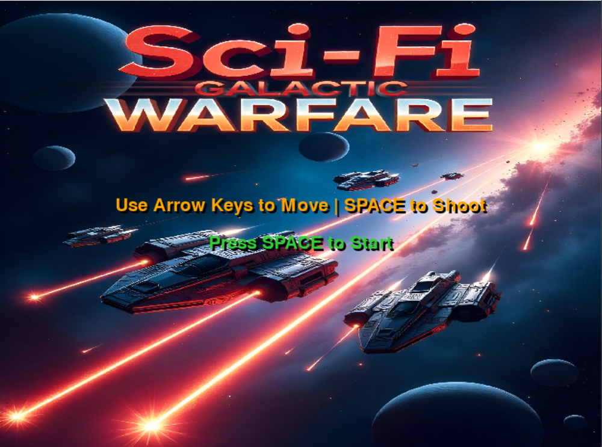
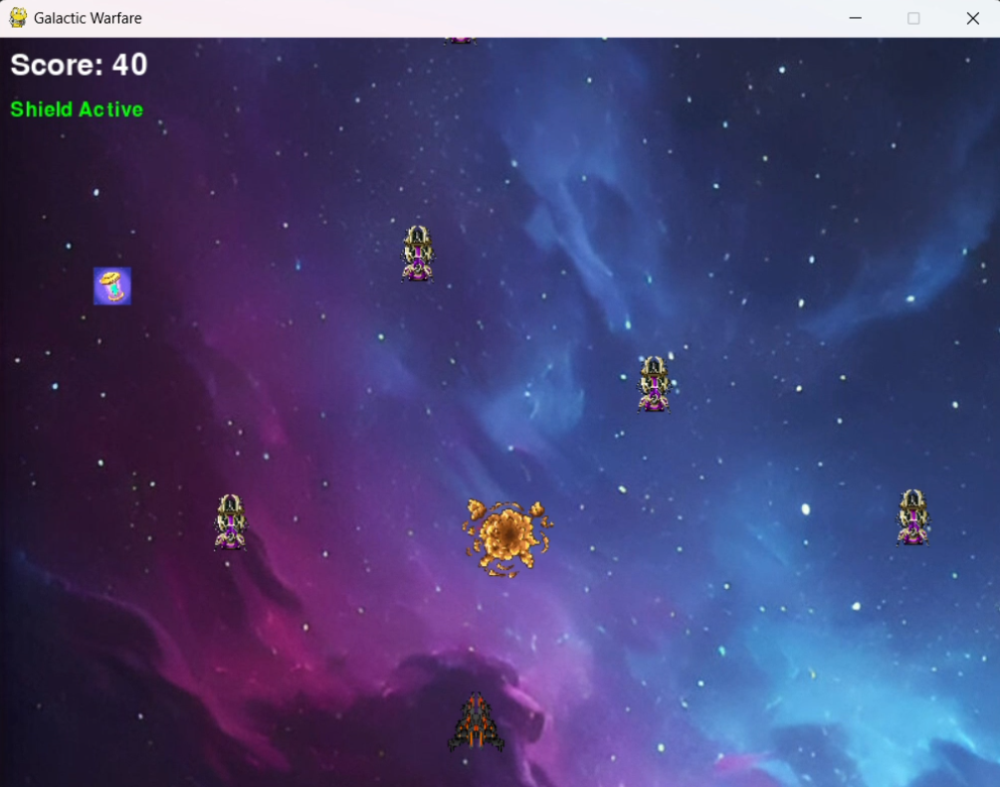
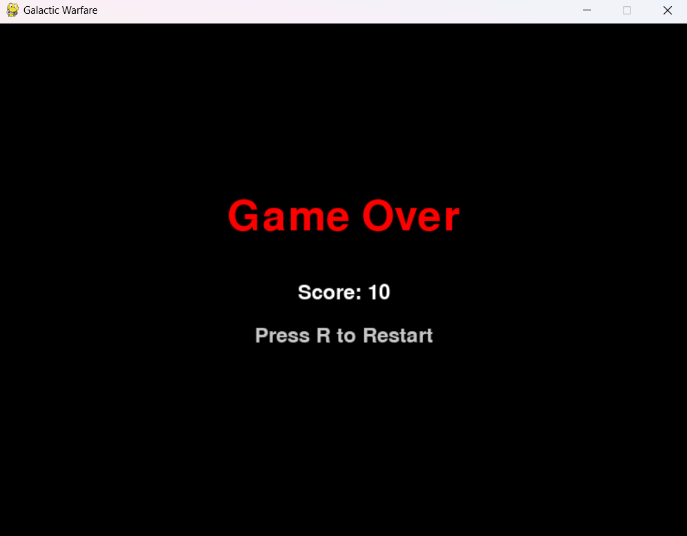

# Sci-Fi-Galactic-Warfare
# PyGame

Developed a sky 🌠 shooting game using python...

Introducing: Sci-Fi Galactic Warfare
A fully immersive, action-packed 2D space shooter 🚀 💥.
built from the ground up using Python and Pygame where design meets logic. and creativity meets code.

What is it?

Sci-fi Galactic Warfare isn't just another arcade game. It's a team-driven game development project where players explore a futuristic galaxy, engage in interstellar battles. dodge Al-powered enemies, and collect power-ups all inside a beautifully ✨ animated cosmic setting.
## ✨ Features  
✅ **AI-Driven Enemies** – Intelligent enemies with increasing difficulty and unique behaviors  
✅ **Firing & Explosion Animations** – Frame-based sprite animations for immersive effects  
✅ **Power-Up System** – Shields, triple-shot, and speed boosts for strategic gameplay  
✅ **Scrollable Space Background** – Seamless infinite scrolling for a deep space feel  
✅ **Modular Codebase** – Clean and scalable architecture for easy enhancements  
✅ **Sound Effects** – Integrated audio for shooting, explosions, and upgrades  
✅ **Game States** – Includes Main Menu, Gameplay, and Game Over screens  

## 🧰 Tech Stack  
- **Python 3.10+** – Core language  
- **Pygame** – Game engine and rendering  
- **Custom Assets** – Sprite-based animations and backgrounds  
- **Open Source Tools** – Freesound, OpenGameArt, Kenney assets
- 
## 🔹 Gameplay Instructions  
🎯 Use **arrow keys** to move the spaceship  
💥 Press **SPACE** to shoot  
⚡ Collect power-ups to gain advantages  
💣 Avoid or destroy enemies to survive  
🛡️ Activate shields and use triple shots to dominate  

## 🖼️ Screenshots  
| Main Menu | In-Game | Game Over |
|-----------|---------|------------|
|  |  |  |

## 🛠 Modules  
- **Player Controller** – Movement, shooting, power-up handling  
- **Enemy AI System** – Enemy spawning, behaviors, and difficulty scaling  
- **Collision Detection** – Player-enemy, bullet-enemy, power-up collection  
- **Graphics & Animation** – Backgrounds, effects, sprite rendering  
- **Audio Manager** – Sound for shooting, explosions, and background music  
- **Game Loop & State Manager** – Controls flow between menus, play, and game over  

## 🌟 Future Enhancements  
- Boss Battles & Level Progression  
- Mobile Version 
- In-game shop and achievements  
- Procedural level generation for endless play  
- Online Leaderboards & Player Profiles  
 

## 🙌 Acknowledgments  
Huge thanks to:  
- **Pygame Community**  
- **Kenney.nl**, **OpenGameArt**, **Freesound.org** for assets  

## 📧 Contact
For any queries, reach out via:

- 📧 Email: nikhilmacharya@gmail.com  
- 🔗 LinkedIn: https://www.linkedin.com/in/nikhilmacharya/
- 🌍 GitHub: https://github.com/NIKHILMACHARYA/

  
